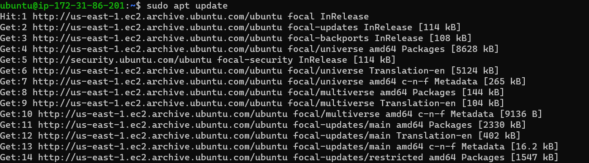
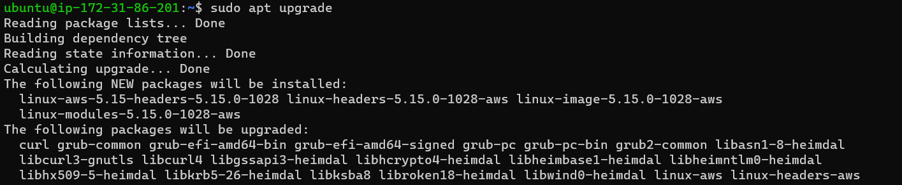
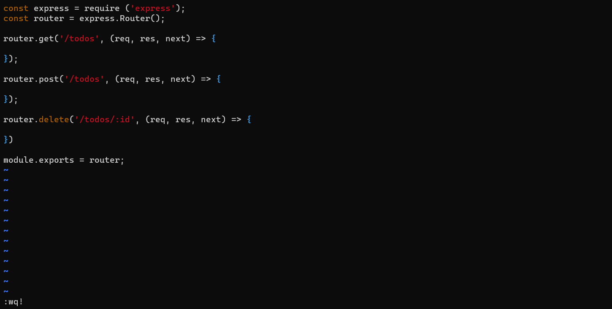

# Project-3
Documentation for project-3

# SIMPLE TO-DO APPLICATION ON MERN WEB STACK

MERN Web stack consists of following components:
MongoDB: A document-based, No-SQL database used to store application data in a form of documents.
ExpressJS: A server side Web Application framework for Node.js.
ReactJS: A frontend framework developed by Facebook. It is based on JavaScript, used to build User Interface (UI) components.
Node.js: A JavaScript runtime environment. It is used to run JavaScript on a machine rather than in a browser.

[Web Application Frameworks](https://en.wikipedia.org/wiki/Web_framework)

[Practice basic JavaScript syntax just for fun](https://www.w3schools.com/js/js_intro.asp)

`sudo apt update`

`Upgrade-ubuntu-sudo-apt-upgrade`

location of Node.js software from Ubuntu repositories

Install Node.js on the server

Run the command below to verify that the Todo directory is created with ls command

Application Code Setup
Create a new directory for your To-Do project:

Next, you will use the command npm init to initialise your project, so that a new file named package.json will be created.

# INSTALL EXPRESSJS

Express helps to define routes of your application based on HTTP methods and URLs.

# MODELS

Install mongoose

Now comes the interesting part, since the app is going to make use of Mongodb which is a NoSQL database, we need to create a model.

A model is at the heart of JavaScript based applications, and it is what makes it interactive.

# STEP 2 – FRONTEND CREATION

it is time to create a user interface for a Web client (browser) to interact with the application via API. To start out with the frontend of the To-do app, we will use the create-react-app command to scaffold our app.

